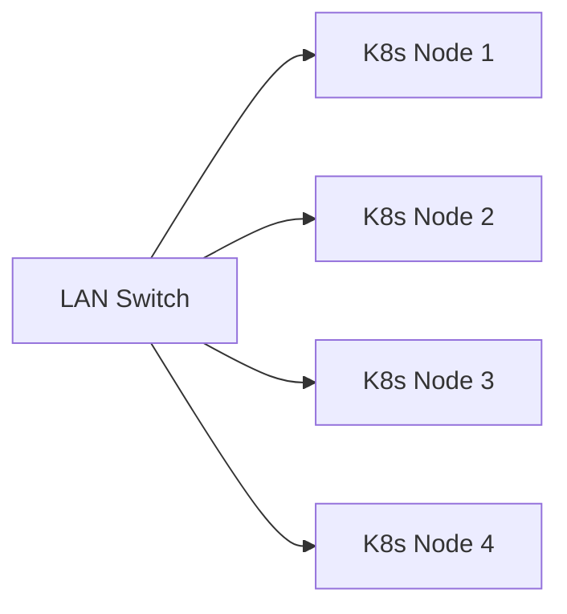
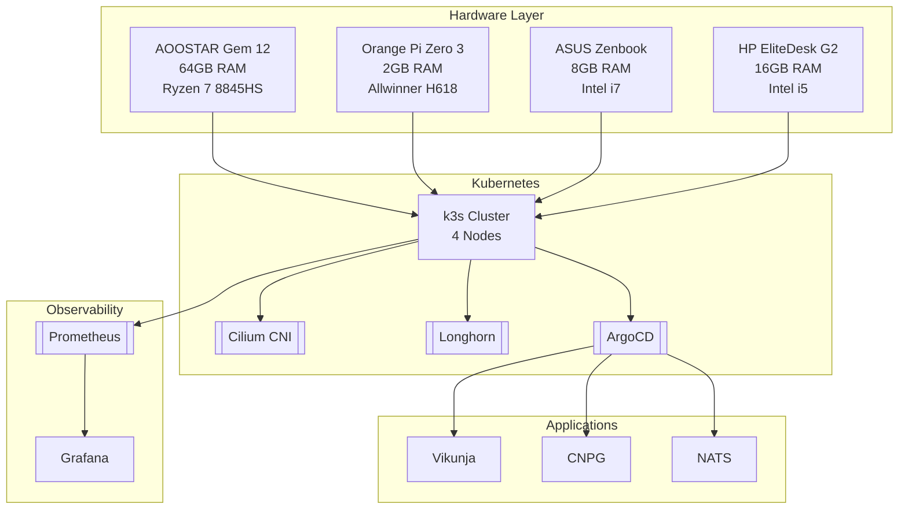

# Homelab Infrastructure

A Kubernetes cluster running on 4 NixOS nodes using k3s.

## Table of Contents
- [Overview](#overview)
- [Infrastructure](#infrastructure)
- [Bootstrapping](#bootstrapping)
- [Configuration Files](#configuration-files)
- [Troubleshooting](#troubleshooting)
- [Maintenance Guidelines](#maintenance-guidelines)
- [Contributing](#contributing)

## Overview

A minimal k3s cluster with Cilium CNI configured on NixOS. The setup includes:
- 4-node cluster
- Custom nixos configuration module
- Cilium CNI with specific values

## Architecture




## Infrastructure

### Nodes
- 4 NixOS nodes
- k3s cluster
- Cilium CNI

### Configuration Files
- [Module](https://github.com/cunialino/dotfiles/blob/main/sys_mods/k3s/default.nix)
- [Cilium Values](./cilium.yaml)

## Bootstrapping Process

1. Run `nixos-rebuild` on all nodes
2. Apply Cilium config: `cilium install --kubeconfig <path>`
3. Deploy ArgoCD: `kubectl apply -f https://argo-cd.readthedocs.io/en/stable/manifests/install.yaml`
4. Configure ArgoCD via web UI
5. Apply bootstrap config: `kubectl apply -f ./bootstrap/root-app.yaml`

## Troubleshooting

### Node Not Joining Cluster

**Symptom**: Node shows as NotReady or doesn't appear in `kubectl get nodes`

**Solutions**:
- Check k3s service status: `systemctl status k3s`
- Review logs: `journalctl -u k3s -f`
- Verify network connectivity between nodes
- Check firewall rules (ensure port 6443 is open)
- Reset and rejoin: `sudo k3s-agent-uninstall.sh && sudo systemctl restart k3s-agent`

### Cilium Connectivity Issues

**Symptom**: Pods cannot communicate or services are unreachable

**Solutions**:
- Check Cilium status: `cilium status`
- Verify Cilium pods are running: `kubectl get pods -n kube-system -l k8s-app=cilium`
- Test connectivity: `cilium connectivity test`
- Check Hubble flows: `hubble observe --verdict DROPPED`
- Review Cilium configuration in [cilium.yaml](./cilium.yaml)

### ArgoCD Sync Failures

**Symptom**: Applications show as OutOfSync or SyncFailed

**Solutions**:
- Check ArgoCD UI for error messages
- Verify Git repository accessibility: `kubectl get secret -n argocd repo-*`
- Check application logs: `kubectl logs -n argocd deployment/argocd-application-controller`
- Manually sync: `argocd app sync <app-name>`
- Check for resource conflicts or missing dependencies

### Storage Issues (Longhorn)

**Symptom**: PVCs stuck in Pending or volume attachment failures

**Solutions**:
- Check Longhorn manager pods: `kubectl get pods -n longhorn-system`
- Verify node disk space: `df -h` on each node
- Check volume status in Longhorn UI
- Review Longhorn logs: `kubectl logs -n longhorn-system -l app=longhorn-manager`
- Ensure iscsid is running on nodes: `systemctl status iscsid`

### External Secrets Not Syncing

**Symptom**: ExternalSecret resources show SyncError

**Solutions**:
- Check ESO pod status: `kubectl get pods -n external-secrets`
- Verify Bitwarden Secrets Manager connectivity
- Check ClusterSecretStore status: `kubectl get clustersecretstore`
- Review ExternalSecret status: `kubectl describe externalsecret <name> -n <namespace>`
- Ensure Bitwarden credentials are valid and not expired

### High Memory/CPU Usage

**Symptom**: Nodes showing high resource utilization

**Solutions**:
- Check resource usage: `kubectl top nodes` and `kubectl top pods --all-namespaces`
- Identify resource hogs: `kubectl describe node <node-name>`
- Review resource limits in pod specifications
- Consider scaling down non-critical workloads
- Check for runaway processes or memory leaks

## Maintenance Guidelines

### Regular Maintenance Tasks

#### Daily
- [ ] Check ArgoCD dashboard for sync issues
- [ ] Review critical alerts in Grafana
- [ ] Verify all nodes are Ready: `kubectl get nodes`

#### Weekly
- [ ] Review and rotate secrets if needed
- [ ] Check disk usage on all nodes: `kubectl describe nodes | grep -A 5 "Allocated resources"`
- [ ] Review Hubble network flows for anomalies
- [ ] Update container images (via GitOps workflow)

#### Monthly
- [ ] Rotate GitHub Personal Access Tokens
- [ ] Review and update Cilium network policies
- [ ] Test backup restoration procedures
- [ ] Review and clean up unused resources
- [ ] Update NixOS configurations and rebuild nodes

#### Quarterly
- [ ] Full cluster backup verification
- [ ] Security audit of deployed applications
- [ ] Review and update documentation
- [ ] Capacity planning assessment

### Updating the Cluster

#### NixOS Updates

```bash
# On each node
sudo nixos-rebuild switch --upgrade

# Verify cluster health after update
kubectl get nodes
kubectl get pods --all-namespaces
```

#### Cilium Updates

```bash
# Update Cilium with new values
cilium upgrade --values ./cilium.yaml

# Verify rollout
kubectl rollout status ds/cilium -n kube-system
```

#### ArgoCD Updates

- Update via GitOps by modifying the ArgoCD application manifest
- Or apply new manifests directly:
```bash
kubectl apply -n argocd -f https://raw.githubusercontent.com/argoproj/argo-cd/stable/manifests/install.yaml
```

### Backup Procedures

#### Critical Data to Backup

- Git repository (already backed up by GitHub)
- Bitwarden vault contents
- Persistent volume data (Longhorn snapshots)
- NixOS configurations (in separate dotfiles repo)

#### Backup Commands

```bash
# Create Longhorn volume snapshot
kubectl apply -f - <<EOF
apiVersion: snapshot.storage.k8s.io/v1
kind: VolumeSnapshot
metadata:
  name: backup-snapshot
  namespace: <namespace>
spec:
  volumeSnapshotClassName: longhorn
  source:
    persistentVolumeClaimName: <pvc-name>
EOF

# Export ArgoCD applications
argocd app list -o yaml > argocd-backup.yaml
```

### Monitoring Checklist

Ensure the following are functioning:

- [ ] Prometheus scraping metrics from all targets
- [ ] Grafana dashboards accessible
- [ ] Hubble UI showing network flows
- [ ] ArgoCD applications in Synced state
- [ ] All nodes Ready and schedulable
- [ ] Longhorn volumes healthy
- [ ] External Secrets syncing correctly
- [ ] No critical alerts firing

### Scaling Considerations

Before adding new workloads:

1. **Resource Check**: Verify cluster has sufficient CPU/Memory
2. **Storage Check**: Ensure adequate disk space
3. **Network Check**: Review Cilium policies for new workloads
4. **Security Review**: Apply appropriate network policies and security contexts

### Emergency Procedures

#### Complete Cluster Recovery

1. Rebuild NixOS nodes from configuration
2. Reinstall k3s with same token
3. Reinstall Cilium with [cilium.yaml](./cilium.yaml)
4. Reinstall ArgoCD
5. Apply bootstrap: `kubectl apply -f ./bootstrap/root-app.yaml`
6. Restore persistent data from backups

#### Node Replacement

1. Remove old node: `kubectl delete node <node-name>`
2. Prepare new node with NixOS
3. Join to cluster with k3s
4. Verify Cilium and Longhorn detect the new node
5. Rebalance workloads if needed
