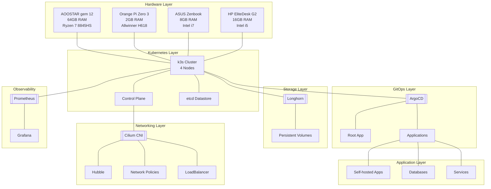

+++
title = "Cluster Architecture"
description = "Overview of the Kubernetes cluster architecture with Mermaid diagrams"
weight = 2

[extra]
+++

This page provides a comprehensive overview of the homelab architecture, showing how different components interact to create a cohesive platform.

## Architecture Overview

This homelab runs a bare metal k3s cluster with a layered architecture:



## Layer Details

### Hardware Layer

The foundation consists of 4 heterogeneous nodes running NixOS:

| Node | CPU | RAM | Role |
|------|-----|-----|------|
| AOOSTAR Gem 12 | AMD Ryzen 7 8845HS | 64GB | Primary node, heavy workloads |
| Orange Pi Zero 3 | ARM Allwinner H618 | 2GB | ARM testing, lightweight services |
| ASUS Zenbook | Intel i7 | 8GB | General compute |
| HP EliteDesk G2 | Intel i5 | 16GB | General compute |

**Key characteristics**:
- **Heterogeneous architecture**: x86_64 and ARM64
- **NixOS**: Immutable, reproducible infrastructure
- **~90GB total RAM**: Distributed capacity
- **Mixed storage**: SSDs of various sizes

### Kubernetes Layer

[k3s](https://k3s.io/) provides a lightweight Kubernetes distribution:

- **Control plane**: Distributed across all 4 nodes (HA setup)
- **etcd**: Embedded datastore for cluster state
- **Container runtime**: containerd (included with k3s)
- **All-in-one nodes**: Each node runs control plane and workloads

### Networking Layer

[Cilium](/networking/cni) serves as the CNI with advanced features:

- **eBPF-based**: High-performance kernel-level networking
- **Kube-proxy replacement**: Direct service handling
- **Hubble**: Network observability and security monitoring
- **Network policies**: Zero-trust security model
- **Encryption**: WireGuard support for pod-to-pod encryption

### Storage Layer

[Longhorn](/storage/longhorn) provides distributed block storage:

- **Replicated volumes**: Data stored on multiple nodes
- **Snapshots**: Point-in-time backups
- **Thin provisioning**: Efficient space utilization
- **Kubernetes native**: StorageClass integration

### GitOps Layer

[ArgoCD](/cicd) enables declarative continuous delivery:

- **Git as source of truth**: All infrastructure defined in Git
- **Automated sync**: Self-healing drift correction
- **Root application pattern**: Single bootstrap point
- **Visual interface**: Web UI for deployment status

### Observability Layer

[Prometheus + Grafana](/monitoring) provide metrics and visualization:

- **Metrics collection**: All cluster components monitored
- **Custom dashboards**: Kubernetes, application, and network views
- **Alerting**: Prometheus Alertmanager (configurable)
- **Retention**: 10-day metrics storage

### Application Layer

[Self-hosted applications](/self_hosting) include:

- **Productivity tools**: Vikunja (task management)
- **Databases**: CloudNative PostgreSQL (CNPG)
- **Messaging**: NATS
- **Custom services**: Personal projects and experiments

## Data Flows

### 1. GitOps Deployment Flow

```
Developer pushes to Git
        │
        ▼
GitHub webhook triggers
        │
        ▼
ArgoCD detects change
        │
        ▼
ArgoCD applies to cluster
        │
        ▼
Kubernetes schedules pods
        │
        ▼
Cilium configures networking
        │
        ▼
Application starts running
```

### 2. Application Request Flow

```
External User
      │
      │ Tailscale VPN
      ▼
Tailscale Node
      │
      ▼
Ingress Controller
      │
      ▼
Cilium LoadBalancer
      │
      ▼
Target Pod
      │
      ├─► Longhorn Volume (if stateful)
      └─► External Service (if needed)
```

### 3. Monitoring Flow

```
Applications & Nodes
      │
      │ Export metrics
      ▼
Prometheus Scraping
      │
      │ Store & aggregate
      ▼
Prometheus Storage
      │
      │ Query
      ▼
Grafana Dashboards
      │
      │ Visualize
      ▼
User Views Metrics
```

## Component Interactions

| Component | Depends On | Used By |
|-----------|-----------|---------|
| k3s | Hardware | All other components |
| Cilium | k3s | Applications, Monitoring |
| Longhorn | k3s | Stateful applications |
| ArgoCD | k3s, Cilium | All deployments |
| Prometheus | k3s | Grafana, Alertmanager |
| Applications | k3s, Cilium, Longhorn | End users |

## Design Principles

### 1. GitOps First

All changes flow through Git, providing:
- Audit trail
- Rollback capability
- Code review process
- Disaster recovery

### 2. Zero-Trust Networking

Cilium enforces:
- Default-deny policies
- Identity-based rules
- Layer 7 filtering
- Encrypted transport

### 3. Observability

Everything is observable:
- Metrics from all components
- Centralized logging (planned)
- Network flow visibility
- Alerting on anomalies

### 4. High Availability

Redundancy at multiple levels:
- Multi-node control plane
- Replicated storage
- Automated failover
- Self-healing deployments

## Technology Stack Summary

| Layer | Technology | Purpose |
|-------|------------|---------|
| OS | NixOS | Immutable infrastructure |
| Kubernetes | k3s | Container orchestration |
| CNI | Cilium | Networking & security |
| Storage | Longhorn | Distributed block storage |
| GitOps | ArgoCD | Continuous deployment |
| Monitoring | Prometheus + Grafana | Observability |
| Secrets | External Secrets + Bitwarden | Secret management |
| VPN | Tailscale | Secure remote access |

## Next Steps

Learn more about specific components:

- **[Security Model](/introduction/security)** - Security practices and network policies
- **[Networking](/networking)** - Deep dive into Cilium and network configuration
- **[Storage](/storage)** - Longhorn setup and storage management
- **[CI/CD](/cicd)** - GitOps workflows and ArgoCD configuration
- **[Monitoring](/monitoring)** - Metrics collection and dashboards
